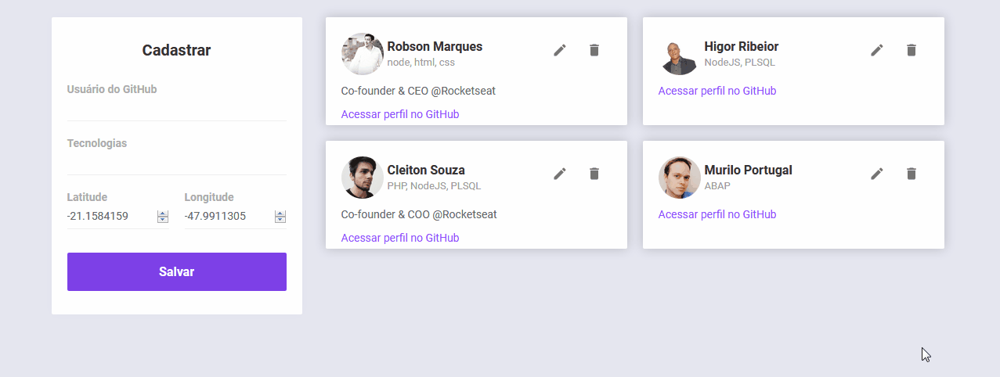

<h1 align="center">Semana OmniStack 10 :rocket:</h1> 
Proposta do projeto DevRadar é localizar desenvolvedores próximos filtrando por tecnologias e atualização em tempo real no aplicativo mobile utilizando websocket.
<p>
<p>

## Instalação
Faça o download ou o clone deste repositório para o seu computador.  
Instale as dependências do back-end.  
```bash
cd backend/
npm install
```  
Instale as dependências do front-end.  
```bash
cd web/
npm install
```  
Instale o [Expo.io](https://expo.io/), necessário para o desenvolvimento do aplicativo mobile.  
```bash
npm install expo-cli --global
```  
Instale as dependências do mobile.  
```bash
cd mobile/
npm install
```  

## Configuração  
Renomeie o arquivo [backend/.env_sample](./backend/.env_sample) para `./backend/.env` e insira sua string de conexão com o MongoDB no parâmetro `DB_STRING=`.  
Altere o endereço de onde esta rodando o seu serviço de back-end nos arquivos [mobile/src/services/api.js](./mobile/src/services/api.js) e [mobile/src/services/socket.js](./mobile/src/services/api.js).  

## Teste
Inicie o serviço de back-end.  
```bash
cd backend/
npm start
```
Inicie o serviço de front-end (Pode demorar um pouco, aguarde até que a página seja aberta em seu navegador automaticamente).  
```bash
cd web/
npm start
```
Inicie o serviço do app mobile (Aguarde até que seja exibido o QRCode na página do navegador ou no terminal onde executou o comando).  
```bash
cd mobile/
npm start
```
Como é somente teste será necessário instalar o aplicativo do Expo.io no seu celular [android](https://play.google.com/store/apps/details?id=host.exp.exponent&referrer=www) ou [IOS](https://itunes.apple.com/app/apple-store/id982107779).  
Abra o aplicativo e escaneie o QRCode gerado ao iniciar o serviço mobile, a aplicação deverá iniciar logo em seguida.  
<br>
Agora com tudo iniciado você pode fazer o cadastro de um novo desenvolvedor através da página informando o nome de usuário do GitHub, em quais tecnologias ele desenvolve, a latitude e longitude deste desenvolvedor ( podem ser informadas automaticamente pela api de geolocalização do navegador).  

<br>
</img>
<br>

No aplicativo você pode digitar a tecnologia que quer procurar e mandar procurar, será exibido todos os devs que estão a 10km da sua posição atual e que desenvolve na tecnologia informada.  
Se um novo dev for cadastrado na página após você realizar uma busca, e este corresponder com os critérios de filtro (tecnologias e distancia) o mesmo será exibido no aplicativo automaticamente.  

<br>
</img>
<br>

## Tecnologias
</img>
</img>
</img>
